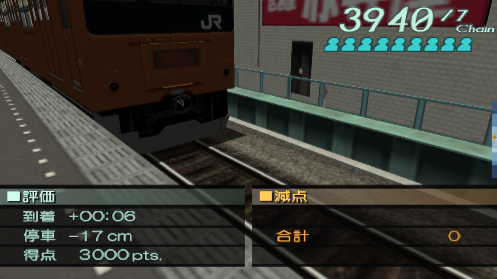
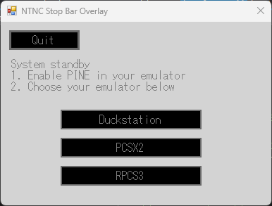

# NTNC Stop Bar Overlay

This application adds a visual stop indicator to train simulators in PCSX2, RPCS3, and Duckstation. The indicator helps to visualize the final few meters of braking, where train simulators typically lack visual references for.

### Notice

- PINE is used to get information from emulators. Ensure that it is enabled. (It is usually a hidden setting.)
- This is a Windows Forms application. Linux support is untested.

### How to Use

1. Locate the EXE and run it.
2. Choose the emulator you want to use.
3. Enable PINE in your emulator.
4. Start your train simulator.
    - If a settings configuration exists for it, the window will turn transparent and cover the window of your emulator.
    - Else, you will need to add a configuration.

### Adding Support for a Game

The file `game.txt` is used to store a list of games and their settings. By default, it contains definitions for very few games, and you will need to add new definitions if you are playing other games. Use the provided configurations as a guide. The typical process for doing so is shown below:

1. With the overlay application running and connected to PINE, enter the game. Write down the disc ID and game version shown on the window.
2. Use Cheat Engine to find the memory address holding the distance to the stopping position. Write the address and its data type (signed integer or floating-point number).
3. In some cases, the distance might not be stored in meters, or it may be in the opposite sign. Use the multiplier to correct this.
4. Choose the aspect ratio, stop bar scale, and stop bar width based on your preferences.
5. Save `game.txt` and restart the overlay application to apply the changes.
6. Enter the game. Check the text shown by the overlay to see if the settings were read correctly.
7. Drive the train to verify the settings, and continue to adjust the appearance if necessary.
